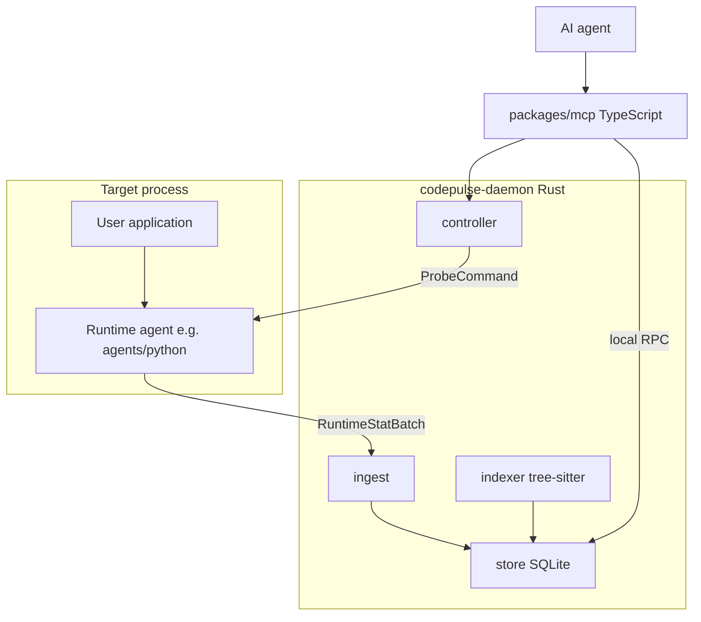

# Architecture

## Stack (locked)

| Layer | Technology | Rationale |
|---|---|---|
| Store, ingest, aggregation, probe controller, indexer | **Rust** | Throughput, low overhead, single binary, tree-sitter embedding |
| Static parsing | **tree-sitter** (Python grammar first) | Fast, multi-language-ready without rewriting the indexer |
| MCP server | **TypeScript (Node ≥20)** | Best MCP ecosystem fit for Cursor / Claude Code |
| Wire protocol | Versioned JSON over HTTP or Unix socket | Language-agnostic |
| First runtime agent | **Python ≥3.12** | Required only to instrument CPython |

Target runtime does **not** choose the platform language. Agents are plugins.

## High-level diagram

## Crates and packages

| Path | Role |
|---|---|
| `crates/protocol` | Shared wire types (`SymbolId`, batches, probe commands) |
| `crates/ingest` | Validate + accept aggregated agent batches |
| `crates/store` | SQLite intelligence store |
| `crates/controller` | Adaptive probe windows and budgets |
| `crates/indexer` | Walk roots, extract symbols via tree-sitter |
| `crates/daemon` | Binary that hosts local APIs |
| `packages/mcp` | MCP tool surface for AI agents |
| `agents/python` | CPython in-process agent (first implementer of agent protocol) |

## Data flow

### Baseline (always on, cheap)

1. Agent samples or coarsely counts function entries inside the target process.
2. Agent aggregates into time windows (e.g. 1–5s) and POSTs `RuntimeStatBatch` to ingest.
3. Ingest merges into `runtime_stats` / `edges` in the store.
4. MCP tools read compact summaries.

### Adaptive deepen

1. AI calls `enable_targeted_instrumentation` via MCP.
2. MCP → controller creates a `probe_window` with targets + duration + budget.
3. Controller sends `ProbeCommand{ action: enable }` to the agent.
4. Agent switches selected symbols to exact call/edge recording for the window.
5. On expiry (or budget breach): disable, flush final batch, MCP returns summary.

### Static join

1. Indexer walks the project root (triggered by CLI / daemon start / later: file watch).
2. Symbols and syntactic edges land in `symbols` (+ optional static edge table).
3. Query layer joins static identity to runtime stats by normalized `SymbolId`.

## Trust and overhead model

- **Budget owner:** controller (max probes, max events/sec, max window duration).
- **Fail-safe:** agent auto-disables targeted mode on budget breach; falls back to baseline.
- **Default privacy:** no argument values, no return values, no locals.
- **Identity:** path + language + qualname; never rely on memory addresses alone.

## Failure modes

| Failure | Behavior |
|---|---|
| Daemon down | Agent buffers briefly then drops with counter; no crash of host app |
| Protocol mismatch | Ingest rejects batch; agent logs and continues baseline if possible |
| Indexer parse error | Skip file; record error; do not fail whole index |
| Probe target unknown | Controller returns structured error to MCP; no partial silent enable |
| Store disk full | Ingest returns 507-equivalent; agent sheds load |

## Process topology (MVP)

- One **daemon** per workspace (or per user machine).
- One or more **target processes** each with an embedded agent.
- One **MCP server** process spawned by the AI host, talking to the daemon.

## Out of scope for architecture v1

- Cluster fan-in / multi-host aggregation
- Hot attach without process restart
- Distributed tracing replacement (OTel can coexist; codepulse is code-centric)
